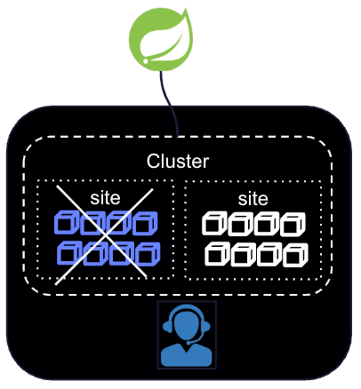

# Valkey 2-Site Cluster Setup & Failover Simulation

This guide walks through setting up a multi-site 6-node Valkey cluster using Podman, connecting a Spring Boot application.



The cluster is split between 2 sites. All primary replicas are on site 1.


## Site monitoring/failover 

The activity simulates a site failure.  The [split brain failover detection script](https://github.com/ggreen/valkey-showcase/blob/main/deployments/local/scripts/2-sites/split-brain-failover-detection.sh) automates promoting replicas in site 2, if all the primaries are down.

### Failover Q&A

#### Questions


    1. Is the script getting deployed in both the DCs ?
    2. What happens when there is network partition between the DCs ? The primary DC would still be accepting writes and split brain would be possible
    
    3. Also, what happens when the valkey is running fine, but the script/service is down.
    
    4. Once the failover happens to DC2, will DC1 always contain the replicas of DC2 ? What if user wants to perform switch-back to DC1 ?


#### Answers

1. Where it should run: The script is meant to act as an external monitoring orchestrator. It should not run only inside DC1. If DC1 suffers a complete site outage or network isolation, a script running strictly inside DC1 will crash/isolate along with the site and fail to trigger the failover. It should ideally run in DC2 or a 3rd arbiter location (witness site/cloud node) where it can independently monitor DC1 nodes and interact with DC2 replicas. This script version has a long-running loop to run continuously in the background. I can typically be managed by a process controller like systemd, Kubernetes DaemonSet/Deployment.
2. The primary DC would still  accept writes and split brain would be possible. The script executes CLUSTER FAILOVER TAKEOVER on DC2 replicas. DC2 replicas forcibly promote themselves to primaries (TAKEOVER ignores cluster consensus), while DC1 primaries are still alive and accepting writes from local clients. Both sides now act as active primaries. 
3. Valkey Cluster manages its own internal heartbeat and automatic failover mechanism between primary and replica nodes via cluster bus gossip messages.
4. When DC1 comes back online, its old primaries will still believe they are primaries until reconnecting with DC2. Once reconnected, the cluster bus syncs state. Because DC2 nodes now have a higher epoch, DC1 nodes will detect this conflict, step down from being primaries, and reconfigure themselves to become replicas of the new DC2 primaries. However, if data diverged significantly during a split-brain, full synchronization (PSYNC/FULLSYNC) will occur, wiping any local writes made on DC1 during the partition.

## To revert DC1 back to primary status and DC2 back to secondary status

TAKEOVER while the cluster is healthy:

- Check the DC1 nodes a replicas of D2
- Execute a cluster failure (note: a takeover) on each DC1 replica node

    valkey-cli -h <DC1_host> -p <DC1_port> CLUSTER FAILOVER 

**Note:** (Using standard CLUSTER FAILOVER instead of TAKEOVER ensures a graceful switch: DC2 primaries pause writes, sync offset with DC1 replicas, swap roles cleanly, and resume traffic without data loss).

## Prerequisites

- Podman installed and running 
- Java 17+ runtime installed 
- Pre-built application JAR at applications/customer-service/target/customer-service-0.0.1-SNAPSHOT.jar


# Workshop 

## 1. Environment Preparation
   Create a dedicated Podman network and a local directory for runtime data:

```shell
podman  network  create valkey

mkdir $PWD/runtime
```


## 2. Start Valkey Nodes

Launch 6 Valkey server containers split across two simulated sites:

- Site 1: Ports 7001–7003 
- Site 2: Ports 7004–7006

```shell
echo "Starting Site 1" 

podman run -d   --rm --network=valkey -p 7001:7001 -v $PWD/runtime:/usr/local/etc/valkey-runtime -v $PWD/deployments/local/valkey/config/multi-site/2-sites:/usr/local/etc/valkey --hostname valkey-site1-server-1 --name valkey-site1-server-1 valkey/valkey:9.1 valkey-server  /usr/local/etc/valkey/valkey-site1-server-1.conf --port 7001
podman run -d --rm --network=valkey -p 7002:7002 -v $PWD/runtime:/usr/local/etc/valkey-runtime  -v $PWD/deployments/local/valkey/config/multi-site/2-sites:/usr/local/etc/valkey --hostname valkey-site1-server-2  --name valkey-site1-server-2 valkey/valkey:9.1 valkey-server /usr/local/etc/valkey/valkey-site1-server-2.conf  --port 7002
podman run -d --rm --network=valkey -p 7003:7003 -v $PWD/runtime:/usr/local/etc/valkey-runtime  -v $PWD/deployments/local/valkey/config/multi-site/2-sites:/usr/local/etc/valkey  --hostname valkey-site1-server-3  --name valkey-site1-server-3 valkey/valkey:9.1 valkey-server  /usr/local/etc/valkey/valkey-site1-server-3.conf  --port 7003

echo "Starting Site 2"

podman run -d --rm --network=valkey -p 7004:7004 -v $PWD/runtime:/usr/local/etc/valkey-runtime  -v $PWD/deployments/local/valkey/config/multi-site/2-sites:/usr/local/etc/valkey  --hostname valkey-site2-server-1  --name valkey-site2-server-1 valkey/valkey:9.1 valkey-server /usr/local/etc/valkey/valkey-site2-server-1.conf  --port 7004
podman run -d --rm --network=valkey -p 7005:7005 -v $PWD/runtime:/usr/local/etc/valkey-runtime  -v $PWD/deployments/local/valkey/config/multi-site/2-sites:/usr/local/etc/valkey  --hostname valkey-site2-server-2  --name valkey-site2-server-2 valkey/valkey:9.1 valkey-server /usr/local/etc/valkey/valkey-site2-server-2.conf  --port 7005
podman run -d --rm --network=valkey -p 7006:7006 -v $PWD/runtime:/usr/local/etc/valkey-runtime  -v $PWD/deployments/local/valkey/config/multi-site/2-sites:/usr/local/etc/valkey  --hostname valkey-site2-server-3  --name valkey-site2-server-3 valkey/valkey:9.1 valkey-server /usr/local/etc/valkey/valkey-site2-server-3.conf  --port 7006
```


## 3. Initialize the Cluster

Join the 6 individual nodes into a cluster with 1 replica per primary:

```shell
podman exec -it valkey-site1-server-1 valkey-cli --cluster create valkey-site1-server-1:7001 valkey-site1-server-2:7002  valkey-site1-server-3:7003 valkey-site2-server-1:7004 valkey-site2-server-2:7005 valkey-site2-server-3:7006  --cluster-replicas 1
```


## 4. Run the Application & Load Test

Start Spring Boot Service
In a new terminal window, launch the application using the clustering profile:

```shell
java -jar applications/customer-service/target/customer-service-0.0.1-SNAPSHOT.jar --spring.profiles.active=clustering --server.port=8070
```


Start Test Loop
In your main terminal, execute the test script to continuously perform read/write events:

```shell
./deployments/local/scripts/user-loop-test.sh
```


## 5. Inspect Cluster Health

Connect to a cluster node and run diagnostic commands:


```shell
podman exec -it valkey-site2-server-3 valkey-cli -c -p 7006 -h 127.0.0.1
```
Inside the valkey-cli prompt:

```shell
CLUSTER NODES
```

View Cluster Details 

```shell
CLUSTER INFO
```

Start script to monitor Cluster Status

```shell
deployments/local/scripts/2-sites/split-brain-failover-detection.sh
```


## 6. Simulate Site Failure & Failover

Force-Crash Site 1

Simulate a complete outage of Site 1 by abruptly stopping its containers:

```shell
podman rm  -f valkey-site1-server-1 valkey-site1-server-2 valkey-site1-server-3
```

Note: script get Internal Server

Example Errors

    Getting customer 03...
    {"timestamp":"2026-08-12T20:12:31.481+00:00","status":500,"error":"Internal Server Error","path":"/customers/03"}


Execute Manual Failover

Promote the Site 2 replicas to primaries using TAKEOVER:

```shell
./deployments/local/scripts/2-sites/split-brain-failover-detection.sh
```

**Verify Cluster Recovery**

Check that all active nodes now reflect updated primary statuses:

```shell
podman exec -it valkey-site2-server-1 valkey-cli -p 7004 -h valkey-site2-server-1 cluster nodes
```


```shell
podman exec -it valkey-site2-server-1 valkey-cli -p 7004
```


Note: Spring Application should now auto-recover with no data loss


    Getting customer 11...

```json
    {"id":"11","first_name":"Jill11","last_name":"Smith","email":"jsmith11@cloudNativeData.io"}
```
    Getting customer 12...


**Application Configuration Notes**

For dynamic recovery to work seamlessly during cluster updates, ensure application.yml configures adaptive topology refreshing in Lettuce:


```yaml
spring:
  data:
    redis:
      # Enable cluster mode and specify node endpoints
      cluster:
        nodes:
          - localhost:7001
          - localhost:7002
          - localhost:7003
          - localhost:7004
          - localhost:7005
          - localhost:7006
      lettuce:
        cluster:
          refresh:
            # Re-fetches the cluster state when errors occur
            adaptive: true
            # Periodically re-fetches cluster topology to ensure it stays up to date
            period: 30s
      # Connection timeouts
      connect-timeout: 3000ms
      timeout: 3000ms
```

-------------------

## 7. Cleanup
   To teardown containers and remove generated configuration/runtime files:

```shell
podman rm -f valkey-site1-server-1 valkey-site1-server-2 valkey-site1-server-3 valkey-site2-server-1 valkey-site2-server-2 valkey-site2-server-3 

rm runtime/*.conf
```