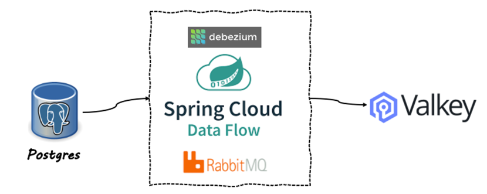
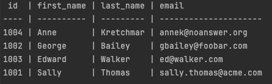
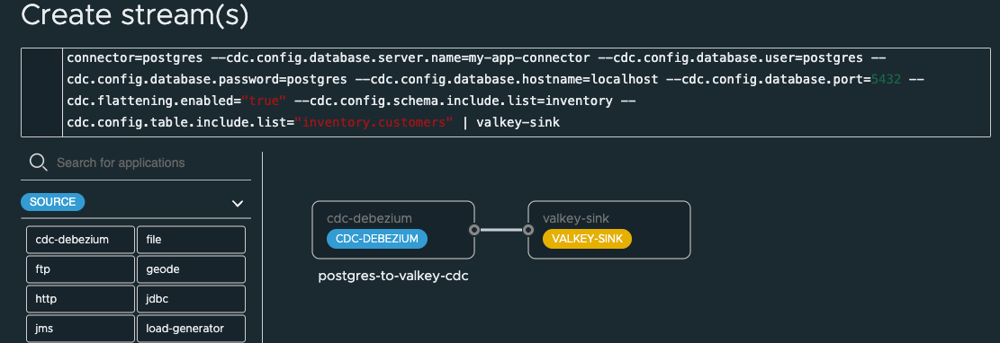
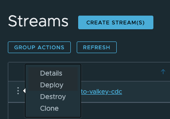

# Postgres CDC to ValKey

Spring Cloud Data Flow has a Change Data Capture (CDC) source based on [Debezium](https://debezium.io/documentation/reference/stable/connectors/index.html).

See the Spring documentation for other [CDC examples](https://spring.io/blog/2020/12/14/case-study-change-data-capture-cdc-analysis-with-cdc-debezium-source-and-analytics-sink-in-real-time)

This example will use the [Spring Cloud Stream Application Debezium CDC source](https://docs.spring.io/stream-applications/docs/current/reference/html/#spring-cloud-stream-modules-debezium-source)
to capture database changes from PostgreSQL in real-time and send to [ValKey](https://valkey.io/) using [RabbitMQ](http://rabbbitmq.com).



This example will sync inventory customer changes in Postgres to ValKey.



## Start Postgres

Run the following to Start Postgres in Docker.

```shell
podman run -it --rm --name postgres -p 5432:5432 -e POSTGRES_USER=postgres -e POSTGRES_PASSWORD=postgres debezium/example-postgres:2.3.3.Final
```

-------------------

## Start ValKey

Run the following to create a Docker network for the ValKey locator and server members to communicate.


Run the following to Start a ValKey

```shell
./deployments/local/valkey/valkey-start.sh
```

------------------

## Setup SCDF

Open [SCDF dashboard](http://localhost:9393/dashboard)

```shell
open http://localhost:9393/dashboard
```

[CREATE STREAMS](http://localhost:9393/dashboard/index.html#/streams/list)

With the following definition

```shell
postgres-to-valkey-cdc=cdc-debezium --cdc.name=postgres-connector --cdc.config.database.dbname=postgres --connector=postgres --cdc.config.database.server.name=my-app-connector --cdc.config.database.user=postgres --cdc.config.database.password=postgres --cdc.config.database.hostname=localhost --cdc.config.database.port=5432 --cdc.flattening.enabled="true" --cdc.config.schema.include.list=inventory --cdc.config.table.include.list="inventory.customers" | valkey-sink --valKey.consumer.key.prefix="customer-"
```


Click Deploy -> Deploy Stream



--------------
# Testing

Once the stream is deployed you can view the initial ValKey data using the CLI.

Run cli

```shell
./deployments/local/valkey/valkey-cli.sh
```

Connect to the locator
```shell
connect
```

Select the customer data

```shell
SCAN 0
```

```shell
GET "ValKeyConsumer-1001"
```

Example response

```shell
"{\"id\":1001,\"first_name\":\"Sally\",\"last_name\":\"Thomas\",\"email\":\"sally.thomas@acme.com\"}"
```


## Insert new data in postgres

Connect to Postgres database using psql

```shell
podman exec -it postgres psql -d postgres -U postgres
```

Select current data

```shell
select * from inventory.customers;
```

Insert new data into inventory customers

```shell
insert into inventory.customers(id, first_name, last_name, email)
values(1005,'Josiah','Imani','jimani@example.email');
```


View Data in ValKey  shell

```shell
SCAN 0
GET "ValKeyConsumer-1005"
```