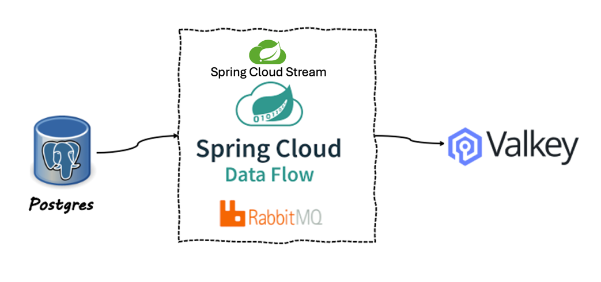

# Postgres CDC to ValKey

Spring Cloud Data Flow has a Change Data Capture (CDC) source based on [Debezium](https://debezium.io/documentation/reference/stable/connectors/index.html).

See the Spring documentation for other [CDC examples](https://spring.io/blog/2020/12/14/case-study-change-data-capture-cdc-analysis-with-cdc-debezium-source-and-analytics-sink-in-real-time)

This example will use the [Spring Cloud Stream Application Debezium CDC source](https://docs.spring.io/stream-applications/docs/current/reference/html/#spring-cloud-stream-modules-debezium-source)
to capture database changes from PostgreSQL in real-time and send to [ValKey](https://valkey.io/) using [RabbitMQ](http://rabbbitmq.com).



This example will sync inventory customer changes in Postgres to ValKey.


## Start Postgres

Run the following to Start Postgres in Docker.

```shell
podman run -it --rm --name postgres -p 5432:5432 -e POSTGRES_USER=postgres -e POSTGRES_PASSWORD=postgres debezium/example-postgres:2.3.3.Final
```

-------------------

## Start ValKey

Run the following to create a Docker network for the ValKey locator and server members to communicate.


Run the following to Start a ValKey

```shell
./deployments/local/valkey/valkey-start.sh
```

------------------

## Setup SCDF

Open [SCDF dashboard](http://localhost:9393/dashboard)


Register Spring Cloud DataFlow

```properties
source.valkey-sql-cdc=file:///Users/Projects/solutions/cloudNativeData/showCase/dev/valkey-showcase/applications/integration/sources/valkey-sql-cdc-source/target/valkey-sql-cdc-source-0.0.1-SNAPSHOT.jar
source.valkey-sql-cdc.bootVersion=3
#sink.valkey-sink.metadata=file:///Users/Projects/VMware/Tanzu/TanzuData/TanzuRabbitMQ/dev/tanzu-rabbitmq-event-streaming-showcase/applications/sinks/jdbc-upsert/target/jdbc-upsert-0.2.0-SNAPSHOT-metadata.jar
```


```shell
open http://localhost:9393/dashboard
```

[CREATE STREAMS](http://localhost:9393/dashboard/index.html#/streams/list)

With the following definition

```shell
postgres-to-valkey-sql-cdc=valkey-sql-cdc --spring.datasource.url="jdbc:postgresql://localhost/postgres" --spring.datasource.username=postgres --spring.datasource.password=postgres --cdc.source.jdbc.lastRowIdWherePosition=1 --cdc.source.jdbc.lastTimestampWherePosition=2 --cdc.source.jdbc.sqlSqlWhereClause="where CAST (id AS INTEGER) > CAST (? AS INTEGER) or order_date > ?" --cdc.source.jdbc.cdcId=postgreSqlToValKey --cdc.source.jdbc.sqlSelectWithFrom="select id, order_date, purchaser, quantity, product_id from inventory.orders"  --cdc.source.jdbc.lastRowIdSelectColumnName=id  --cdc.source.jdbc.lastTimestampSelectColumnName=order_date --cdc.source.schedule.cron="*/10 * * * * *"  | valkey-sink --valKey.consumer.key.prefix="orders-"
```


Then Click Deploy -> Deploy Stream


--------------
# Testing

Once the stream is deployed you can view the initial ValKey data using the CLI.

Run cli

```shell
./deployments/local/valkey/valkey-cli.sh
```

Select the customer data

```shell
SCAN 0
```

```shell
GET orders-10001
```

Example response

```shell
"{\"order_date\":1452920400000,\"quantity\":1,\"purchaser\":1001,\"product_id\":102,\"id\":10001}"
```


## Insert new data in postgres

Connect to Postgres database using psql

```shell
podman exec -it postgres psql -d postgres -U postgres
```

Select current data

```shell
select * from inventory.orders;
```

Insert new data into inventory customers

```shell
INSERT INTO inventory.orders
(id, order_date, purchaser, quantity, product_id)
VALUES(nextval('inventory.orders_id_seq'::regclass), now(), 1002, 10, 102);
```

or use a fixed id

```shell
INSERT INTO inventory.orders
(id, order_date, purchaser, quantity, product_id)
VALUES(999999, now(), 1002, 10, 102);
```


View Data in ValKey  shell

```shell
SCAN 0
GET "ValKeyConsumer-999999"
```